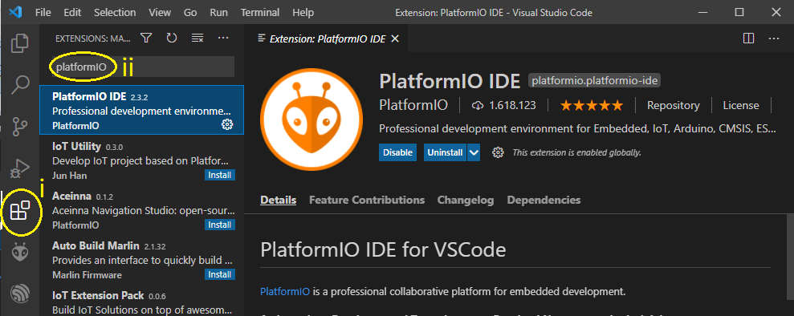

# Instrucoes Para Clonar Projetos PlatformIO
Esse repositório descreve como clonar os projetos desenvolvidos no VSCode/PlatformIO

1. Instale o [VS Code](https://code.visualstudio.com/) Se já não tiver instalado.

1. Instale a Extensão PlatformIO no VScode
   1. No VSCode clique em Extensions
   1. Procure por PlatformIO e instale.
   
   
   
3. Clone o Projeto
   1. Abra o PlatformIO pelo ícone do lado esquerdo
   1. Vá na opção "Clone Git Project".
   1. Cole a URL do projeto do Github, pressione enter, e escolha o local de salvamento do repositório
   
   

4. Abra o Projeto
   1. Abra a extensão PlatformIO
   1. Em "PlatformIO Home" vá na opção "Open"
   1. Vá em "Open Project", navegue até a pasta em que o projeto está salvo e abra o projeto.
   
    
    
5. Na primeira vez que abrir o projeto, espere alguns instantes enquanto o PlatformIO gera a árvore de projeto para seu computador local
   

6. O projeto está pronto para uso. Para saber mais como usar o PlatformIO acesse seus [Tutoriais Oficiais](https://docs.platformio.org/en/latest/tutorials/index.html). 
